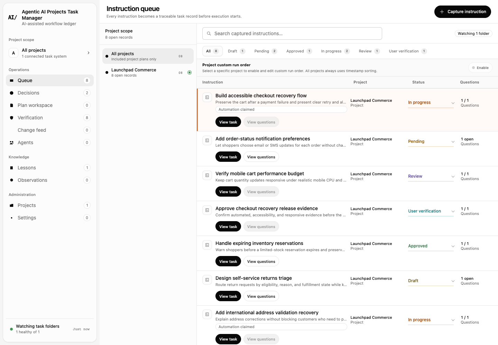
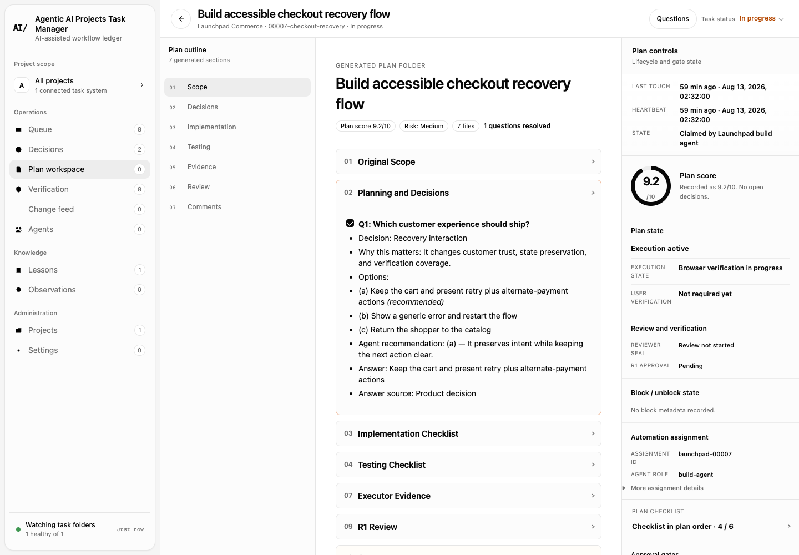
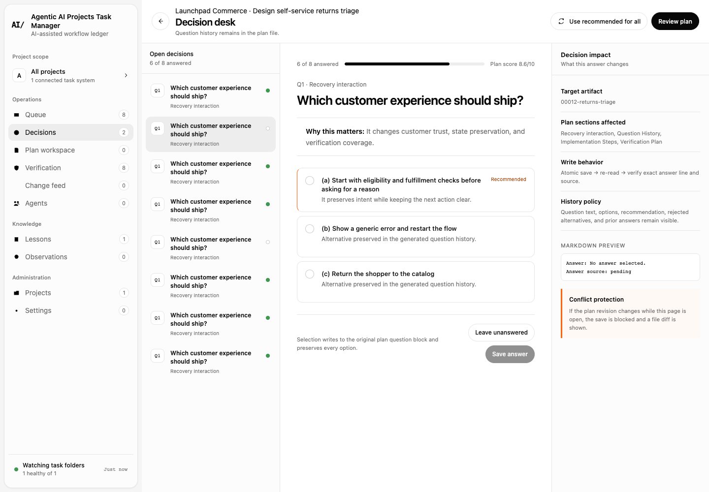
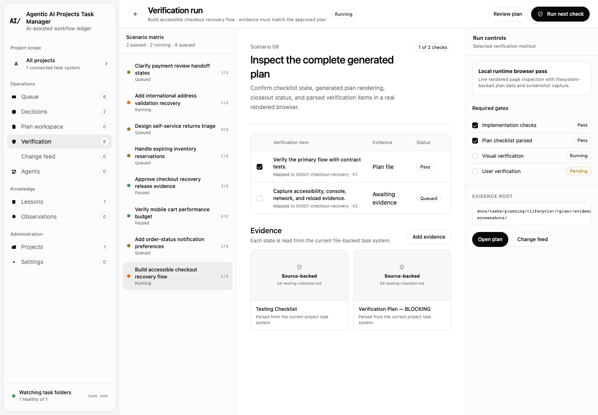
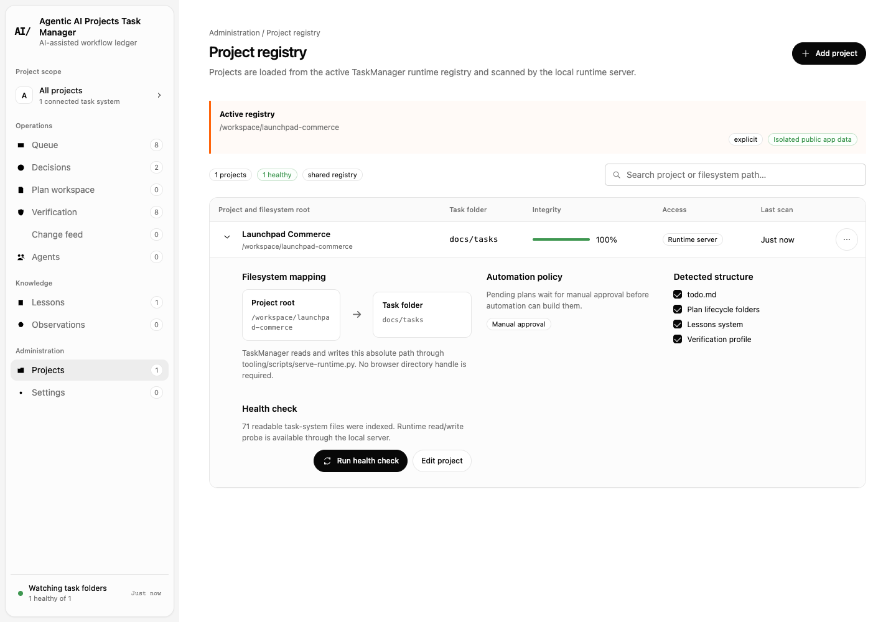
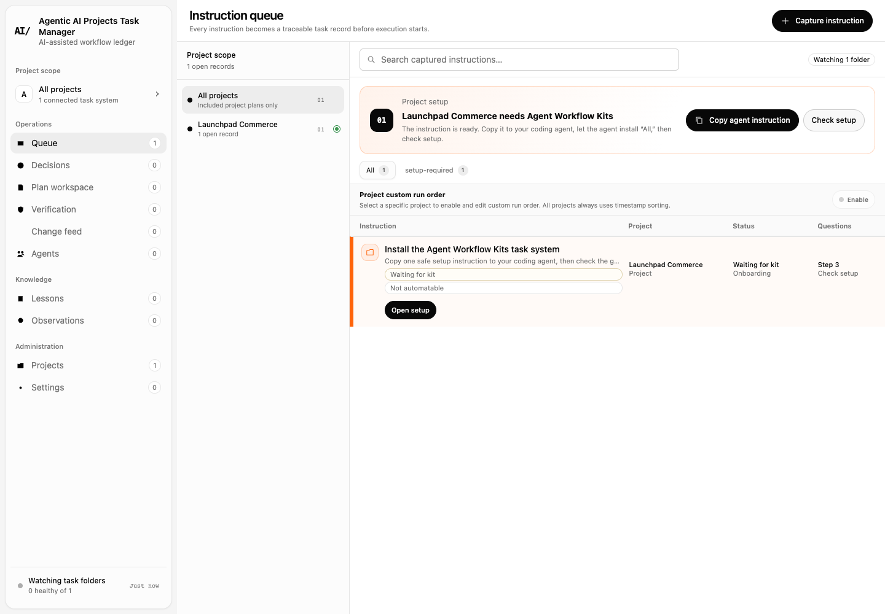
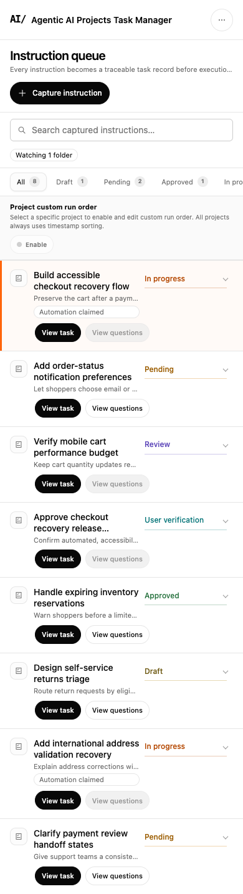

# AI Task Manager Web App

Maintained by [aipieksel](https://github.com/aipieksel). Upstream credits and licenses remain with their respective authors.

AI Task Manager brings software task plans from your local project folders into one place. It helps you see what is waiting, what an agent is working on, which decisions need an answer, and which completed changes still need verification. The project files remain the source of truth; the app reads and writes the supported Markdown and JSON task records instead of moving them into a hosted account.

Connect one or more projects to view their queues, plans, activity, lessons, and verification. When a new project has no compatible task system, the app offers a copyable setup instruction for a coding agent and checks the resulting files before unlocking the full workspace. It runs as a PWA, a local writable web app, or an unsigned Electron desktop build. There is no built-in telemetry.

## A typical workflow

1. Add a project folder and check whether its `docs/tasks` contract is ready.
2. Review the queue, answer open planning questions, and follow work through its lifecycle.
3. Inspect verification evidence and record your own acceptance in the project's task files.

## What it does

- Aggregates task-system folders from multiple local projects.
- Presents queue, plan-detail, question, verification, activity, agent, lesson, observation, project, and settings views.
- Writes lifecycle changes and user-verification feedback back to the project’s Markdown/JSON task records.
- Runs as a PWA, a local writable web app, or an unsigned Electron desktop build.
- Uses isolated public app data under `Agentic AI Projects Task Manager`; it does not import another product’s registry automatically.
- Works with any coding agent or human workflow that follows the documented task-folder contract.

## See the real workflow



The queue combines active work across project folders while keeping status, questions, and verification visible.



Plans stay source-backed: decisions, recommendations, answers, and checklists are read from the project rather than copied into a hosted database.



Open decisions remain attached to their generated plans, including alternatives, recommendations, selected answers, and write targets.





The screenshots use a deterministic sanitized fixture generated by [`tooling/demo/create_populated_project.py`](tooling/demo/create_populated_project.py). It is never copied to `dist/`, the service-worker cache, or the default runtime registry.

## How project setup works



Task Manager is the interface; [Agent Workflow Kits](https://github.com/aipieksel/ai-agent-workflow-kits) creates the project documentation, task lifecycle, and verification contract it reads.

```text
Select a project folder
        ↓
Task Manager checks docs/tasks
        ↓
If missing: create one local setup instruction
        ↓
Copy it to Codex, VS Code/Copilot, or another coding agent
        ↓
The agent installs Agent Workflow Kits “All”
Documentation → Task → Verification
        ↓
Choose “Check setup”; the populated project unlocks
```

When an unconfigured folder is added, Task Manager does not fail with an opaque filesystem error and does not run external software. It offers one opt-in, non-automatable setup task and writes only:

- `docs/tasks/.taskmanager-bootstrap.json`
- `docs/tasks/onboarding/install-agent-workflow-kits.md`

Copy the instruction to a capable coding agent. It pins Agent Workflow Kits to tag `v1.0.0` (commit `928dd48b86385177d62646866acbaeaf13f5af77`), asks the agent to inspect the installer, select **All**, preserve existing content, validate the output, and avoid committing or pushing. Task Manager marks the project healthy only when these canonical markers exist:

- `docs/tasks/workflow.md` and `docs/tasks/todo.md`
- `docs/tasks/planning/`
- `docs/tasks/lessons-active.md` and `docs/tasks/lessons-index.json`
- `docs/tasks/task-system.config.yaml`
- `docs/tasks/verification.md`

Existing compatible legacy task roots remain supported. Bootstrap-only or partially generated folders remain visibly gated; altered bootstrap paths produce a conflict instead of being overwritten.

### Security boundary

Task Manager never clones, downloads, installs, or executes Agent Workflow Kits. The local Python/Electron runtime confines bootstrap writes to the two allowlisted relative paths, rejects symlink/path escapes, uses revision checks and atomic writes, and treats identical retries as idempotent. Review the external kit and copied instruction before asking your coding agent to act.

### Troubleshooting setup

- **Setup incomplete:** run the copied instruction with the coding agent, then choose **Check setup** again. The UI lists missing contract markers.
- **Setup conflict:** inspect the exact relative paths shown. Task Manager has not overwritten them. Preserve user-owned content and resolve the merge with your agent.
- **Project already uses another layout:** set an explicit supported task root in Projects. Compatible legacy roots continue to scan.
- **Nothing changes after the agent finishes:** confirm the generated root is exactly `docs/tasks`, run the kit validation, then rescan.

## Screenshots on mobile



The mobile queue keeps task identity, lifecycle status, and actions readable without forcing the desktop columns into a narrow viewport.

## Quick start

Requirements: Node.js 20 or newer, npm, and Python 3.11 or newer.

```bash
npm ci
npm test
./start-app.sh
```

Open `http://127.0.0.1:8765/`. Use **Projects** to select any software project folder. If it is not configured yet, follow the in-app Agent Workflow Kits setup task; if it is already compatible, Task Manager loads it immediately.

For the desktop app on macOS:

```bash
npm run electron:pack
open "build/release/mac-arm64/Agentic AI Projects Task Manager.app"
```

The packaged app is unsigned. Signing and notarization are intentionally outside this repository’s default build.

## Development

```bash
npm run build:web      # rebuild dist/ and DEPLOY_MANIFEST.json
npm test               # unit, contract, static, source/dist browser and filesystem checks
npm run electron:dev   # build the web app and open Electron
```

Production source lives only in `src/taskmanager/`. `dist/` and `DEPLOY_MANIFEST.json` are generated. The production boundary requires zero mockup data and zero dummy data. Reference, test, operational, and private runtime material must not be deployed.

## Architecture and privacy

- `src/taskmanager/js/domain/` parses and writes task Markdown.
- `src/taskmanager/js/features/` owns route-level Task Manager views.
- `src/taskmanager/js/services/` connects UI actions to the local runtime.
- `tooling/scripts/serve-runtime.py` and `electron/runtime-server.cjs` provide matching confined filesystem endpoints.
- `docs/tasks/` defines the reusable lifecycle, schema, planning, review, and verification contracts.

The default desktop/runtime registry begins as `{ "version": 1, "projects": [] }` in the product’s own Application Support directory. No legacy registry is read, merged, copied, or migrated. Network activity is limited to locally served application/runtime requests unless a user adds their own external tooling outside this application.

## Scope and roadmap

The app focuses on software-task work. Rich collaborative documents, databases, realtime multi-user editing, hosted sync, and general-purpose knowledge pages are outside its current scope. Contributions that deepen reliable task planning, lifecycle coordination, verification, accessibility, portability, and privacy are welcome.

## Community and security

See [CONTRIBUTING.md](CONTRIBUTING.md), [SECURITY.md](SECURITY.md), and [CODE_OF_CONDUCT.md](CODE_OF_CONDUCT.md). By participating, you agree to follow the code of conduct.

Licensed under the Apache License 2.0. See [LICENSE](LICENSE) and [NOTICE](NOTICE).

The package/folder name is `ai-task-manager-web-app`. The installed product name and storage identifiers remain `Agentic AI Projects Task Manager` for compatibility with existing local data.
